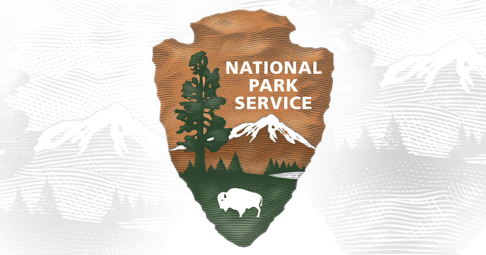

# 
 Plan Your Next Vacation 

## Overview

Let's plan your next vacation to one of the many national parks!

This collaborative project will allow the user to utilize an interactive dashboard that will help them plan their next vacation. The data includes information on weather, activities, location, associated fees, and much more!

## Analysis 

Data was collected from the national park service api as well as a weather api. Jupyter notebook was utilized to initially clean the data before it was transformed into the sqlite database. From the sqlite database, an api was created using Flask. Data was called from respective tables to create the dashboard with the following interactive plots:

-

-

-

## Results 
